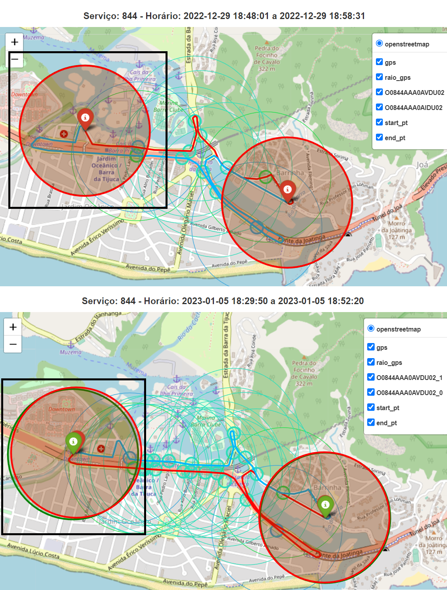
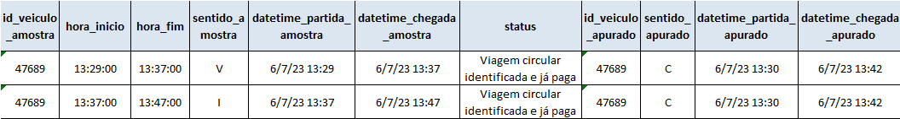

# Recurso: SMTR202211008775

---

## Contexto

**Solicitação**: "Bom dia. Solicito a verificação do sistema do desenho e localização dos pontos da linha 844. Ocorre que desde o inicio da avaliação das viagens esta linha nunca consegue que a apuração da SMTR atinja o planejado, mas a empresa opera a linha conforme os parâmetros estabelecidos pela SMTR. Parece ser alguma falha sistêmica, pois a linha é muito curta, ligando o Jardim Oceânico a Barrinha. Obrigado.".

**Linha afetada**: 844

**Período**: 01/06/2022 até 31/12/2022

## Resumo

### Problema

Foi identificado que o valor da quilometragem apurada permaneceu baixo ao longo de todo o ano de 2022, o que impactou diretamente o POD.

### Solução

A partir de 01/01/2023, o aumento na quilometragem apurada coincidiu com a data de alteração da localização no ponto de início e de término das viagens do shape. A solução encontrada foi o reprocessamento das viagens de 2022 com o shape da data supracitada. A explicação detalhada segue na próxima seção.

### Resultado

> **Status: Bloqueado**. Aguardando tabela de recursos para remover dias que foram pagos pela média (Reprocessamento e Bloqueio de Via).

**Valor a pagar: R\$ 32.924,75**

- Com a solução, foram identificadas 100% das viagens da amostra enviada no recurso;
- A quilometragem total aumentou em 70% após o reprocessamento;
- O valor do subsídio aumentou em 68% (R\$ 5.237,7 para R\$
  38.162,45). O novo valor, porém, foi calculado sem os
  descontos por tipo de viagem que eram aplicados à epoca.

## Análise exploratória

Foi identificado que o baixo valor do POD em 2022 foi causado pela também baixa quilometragem apurada.

Em 01/01/2023, a quilometragem apurada aumenta, o que resulta também no aumento do POD, que permanece acima de 80% na maior parte de 2023. 

O momento deste aumento coincide com a data de alteração da localização no ponto de início e de término das viagens do shape.

A solução proposta envolve o reprocessamento das viagens entre 01/01/2022 até 31/12/2022 com o shape de 01/01/2023.

Vale destacar que a amostra recebida tratou as viagens, que são de uma linha circular, como se fossem viagens separadas de ida e de volta:

### Método de avaliação da amostra

A comparação entre o `datetime_partida` do gabarito e da solução foi feita com uma margem de 4 minutos para mais ou para menos, por se tratarem de viagens curtas.

## Reprocessamento

O reprocessamento seguindo os critérios acima para o período entre 01/06/2022 e 31/12/2022 está disponível no dataset `rj-smtr-dev.SMTR202211008775_reprocessamento`.

### Resultados

De todas as 280 viagens que constam na amostra:
- 141 já foram pagas;
- 120 foram identificadas após o reprocessamento;
- 13 não tiveram sinal de GPS dentro do raio de 500m do ponto inicial ou final do trajeto;
- 5 não atenderam o percentual de conformidade do GPS ou do trajeto; e
- 1 o veículo não emitiu sinal de GPS no momento da viagem.

Reitera-se aqui que a amostra recebida tratou as viagens circulares como se fossem viagens separadas de ida e de volta, ou seja, na verdade, a amostra não contém 280 viagens, mas sim 140 viagens circulares.

1) A quilometragem total das viagens completas aumentou de 13.033,9 km para 22.121,8 km, um aumento de 70% após o reprocessamento.

2) A quantidade de viagens identificadas aumentou de 1.920 para 3.258 viagens.

3) O valor do subsídio antes do reprocessamento era de R\$ 5.237,7 e após o reprocessamento foi de R\$ 38.162,45. Vale destacar que o valor do reprocessamento foi calculado sem os descontos por km, ou seja, considerando a liminar que derrubou as glosas.

4) Por fim, o fato de o reprocessamento ter identificado mais viagens também melhorou o POD do serviço forma geral:

