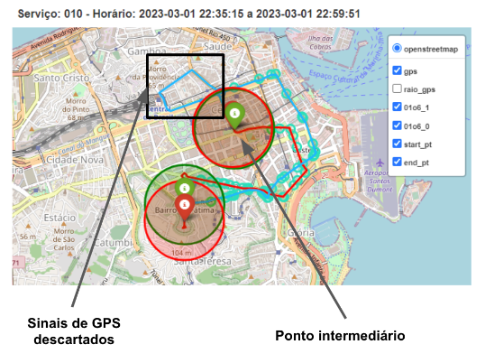
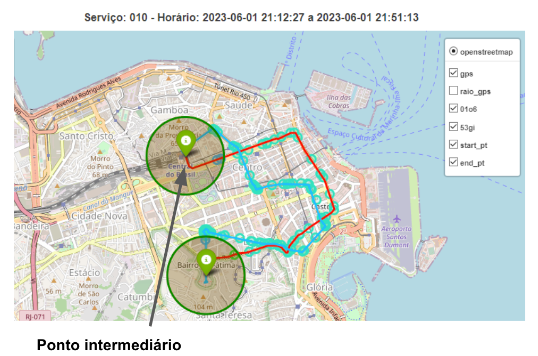
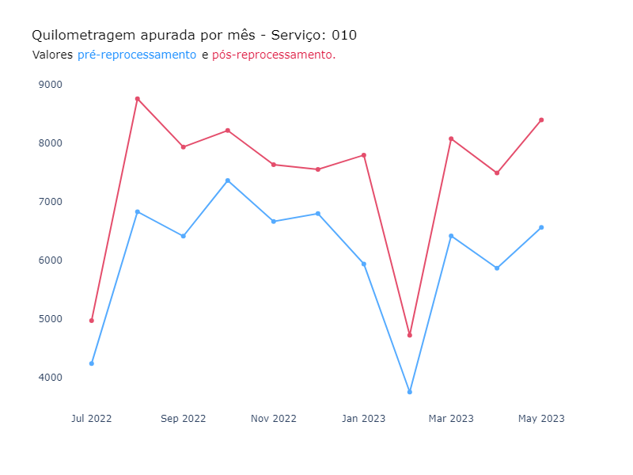
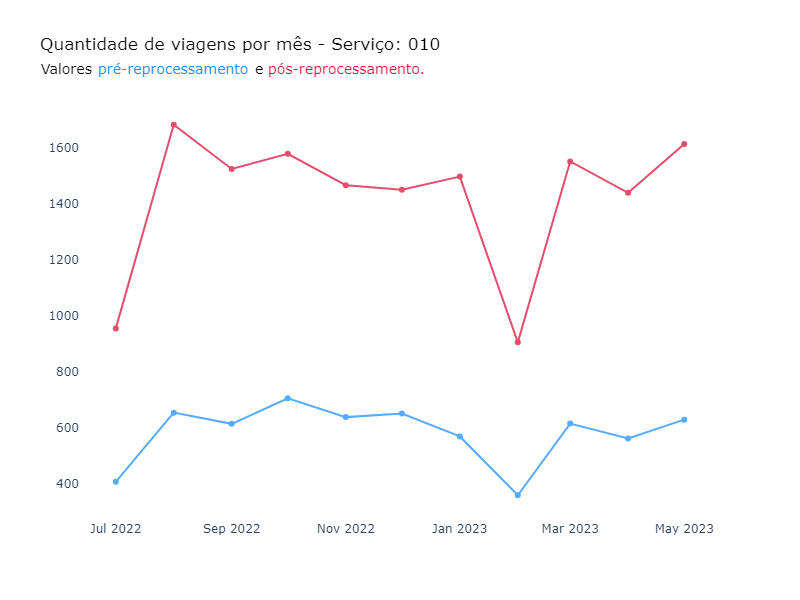
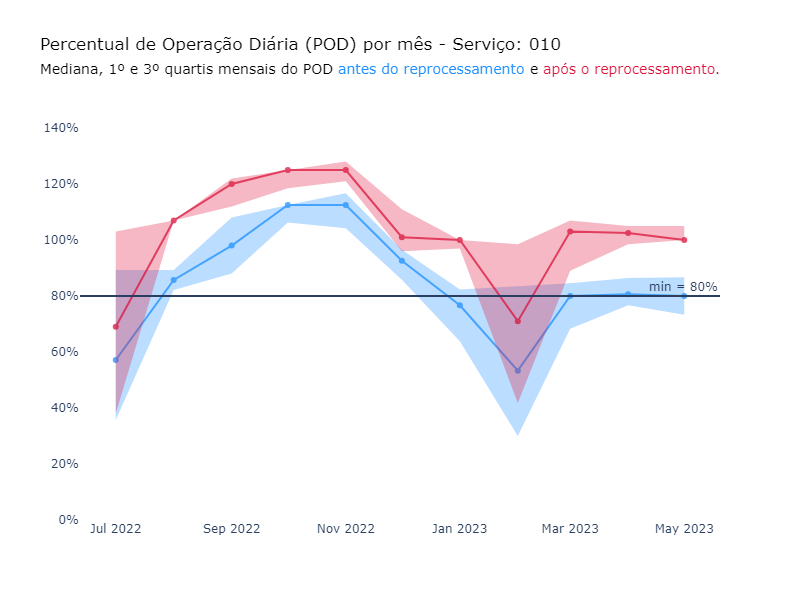

# Recurso: SMTR202212006611

**Solicitação**: "Bom dia, Solicitamos a verificação do itinerário da linha 010, por ser uma linha do tipo circular e com 2 pontos finais, verificamos que diversas viagens não estão sendo apuradas, solicitamos a verificação".

**Linha afetada**: 010

**Período**: 01/06/2022 até 31/05/2023

--------

## Resumo

**1. Problema**: Viagens não foram identificadas devido ao
formato do trajeto. Por ter um laço próximo ao raio do ponto de quebra
do trajeto (ponto médio), os sinais de GPS percorridos nesse laço são perdidos entre
as meias-viagens. Por consequência, o % de minutos da viagem
cobertos por GPS fica menor do que deveria, invalidando viagens que
deveriam ser válidas (Figura 1). A explicação detalhada segue na próxima seção.

**2. Solução**: Identificamos que a partir de 01/06/23 o problema é
resolvido com a quebra do trajeto circular em ida e volta (sem
alterações na rota). Portando, a proposta é realizar o reprocessamento das viagens entre 01/06/2022 e
31/05/2023 utilizando os trajetos de ida e volta.

**3. Resultado**:

- Com a solução, foram identificadas 99% das viagens da amostra enviada no recurso;
- A quilometragem total aumentou em 22% após o reprocessamento;
- A quantidade de viagens aumentou em 144%, ou seja, 44% de viagens
  extras foram identificadas (1 viagem circular passa a ser 1 ida + 1
  volta, portanto 100% seria se manter constante);
- O valor do subsídio aumentou em 68% (R\$ 100.756,68 para R\$
  169.626,86). O novo valor, porém, foi calculado sem os
  descontos por tipo de viagem que eram aplicados à epoca.

## 1. Análise exploratória

- TODO: Adicionar detalhes de como foi encontrada a solução (como
  descobrimos a quebra do shape em ida + volta? -> grafico POD por mes, etc)

 

<!-- Após a análise do trajeto para a primeira quinzena de janeiro de 2023, foi identificada uma inconsistência em que alguns sinais de GPS foram descartados no trecho em "laço" (ver figura abaixo).

Ao considerar o shape de 01/06/2023, que divide a viagem circular em ida e volta, os sinais de GPS foram devidamente identificados:

 -->

## 2. Teste amostral

A partir da alteração do shape, os dados da primeira quinzena de janeiro de 2023 foram reprocessados e comparados com os dados do gabarito enviado pelo consórcio operacional (dados disponíveis [aqui](https://docs.google.com/spreadsheets/d/11jKNeWoXB4Uke4WWwWsjHo8I-ZRr8f3Y/edit#gid=1849603428)).

### Método

A comparação entre o `datetime_partida` do gabarito e da solução foi feita com uma margem de 10 minutos para mais ou para menos.

Para as viagens não encontradas na etapa anterior, foi verificado se os veículos operaram nos dias e horários apontados no gabarito, com base em dados de GPS e do reprocessamento de conformidade das viagens proveniente do dataset `rj-smtr-dev.20230818_projeto_subsidio_sppo_010`

### Resultados

- Foram identificadas 699 das 706 viagens do gabarito (99%) em um intervalo de + ou - 10 minutos entre os `datetime_partida` do gabarito e da solução.

- Sobre as sete viagens não identificadas:
    1) Em três casos os veículos não emitiram sinais de GPS no horário indicado no gabarito.
    2) Em dois casos os veículos operaram em outro serviço no horário indicado no gabarito (serviço 007).
    3) Em dois casos a viagem ocorreu, mas ficou um pouco acima da margem de + ou - 10 minutos
    4) Foram trinta e cinco casos de viagens que foram encontradas na solução, porém não constam no gabarito.

## 3. Reprocessamento

O reprocessamento seguindo os critérios acima para o período entre 01/06/2022 e 31/05/2023 está disponível no dataset `rj-smtr-dev.SMTR202212006611_reprocessamento`.

Mesmo antes do reprocessamento, não foram encontradas viagens planejadas da linha 010 no mês de junho de 2022.

### Resultados

1) A quilometragem total das viagens completas aumentou de 66.790,1 km para 81.485,2 km, um aumento de 22% após o reprocessamento.

2) A quantidade de viagens identificadas aumentou de 6.414 para 15.670 viagens. Como as viagens que antes eram circulares foram divididas em duas viagens (ida e volta), era esperado que a quantidade de viagens pelo menos dobrasse, mesmo se nenhuma nova viagem fosse identificada.

3) O valor do subsídio antes do reprocessamento era de R\$ 100.756,68 e após o reprocessamento foi de R\$ 169.626,86. Vale destacar que o valor do reprocessamento foi calculado sem os descontos por km, ou seja, considerando a liminar que derrubou as glosas.

4) Por fim, o fato de o reprocessamento ter identificado mais viagens também melhorou o POD do serviço forma geral:

