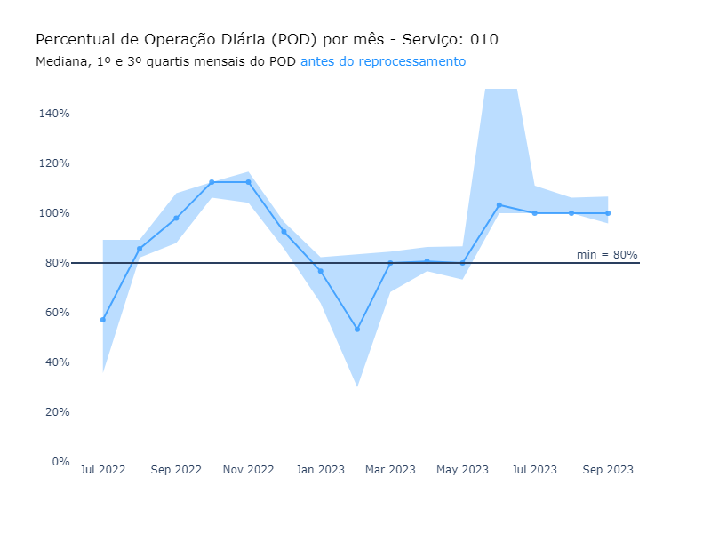
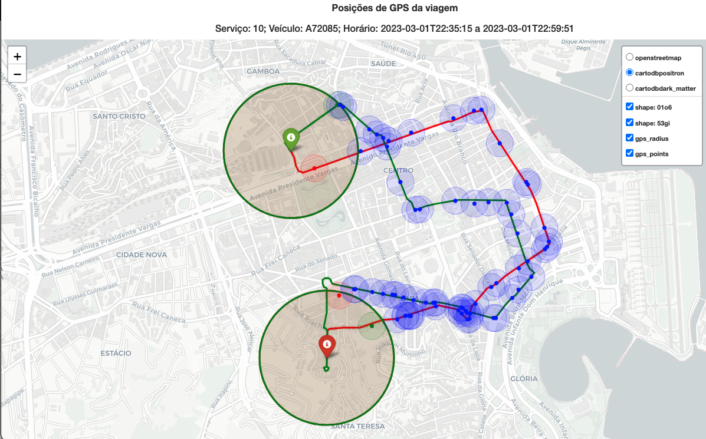
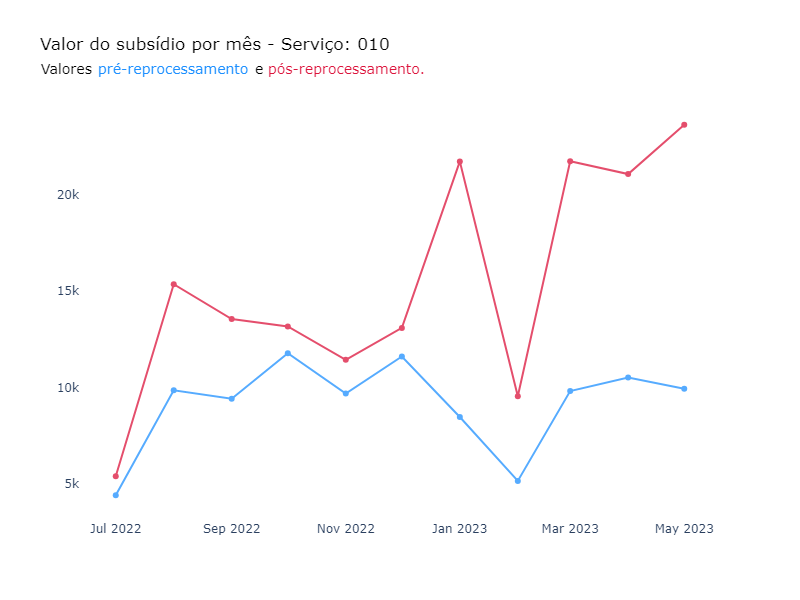

# Recurso: SMTR202212006611

---

## Contexto

**Solicitação**: "Bom dia, Solicitamos a verificação do itinerário da linha 010, por ser uma linha do tipo circular e com 2 pontos finais, verificamos que diversas viagens não estão sendo apuradas, solicitamos a verificação".

**Linha afetada**: 010

**Período**: 01/06/2022 até 31/05/2023

## Resumo

### Problema

Viagens não foram identificadas devido ao
formato do trajeto. Por ter um laço próximo ao raio do ponto de quebra do trajeto (ponto médio), os sinais de GPS percorridos nesse laço são perdidos entre as meias-viagens. Por consequência, o % de minutos da viagem cobertos por GPS fica menor do que deveria, invalidando viagens que deveriam ser válidas (Figura 1). A explicação detalhada segue na próxima seção.

### Solução

Identificamos que a partir de 01/06/23 o problema é resolvido com a quebra do trajeto circular em ida e volta (sem alterações na rota). Portando, a proposta é realizar o reprocessamento das viagens entre 01/06/2022 e 31/05/2023 utilizando os trajetos de ida e volta.

### Resultado

> **Status: Bloqueado**. Aguardando tabela de recursos para remover dias que foram pagos pela média (Reprocessamento e Bloqueio de Via).

**Valor a pagar: R\$ 68.870,18**

- A quilometragem total aumentou em 22% após o reprocessamento;
- A quantidade de viagens aumentou em 144%, ou seja, 44% de viagens
  extras foram identificadas (1 viagem circular passa a ser 1 ida + 1
  volta, portanto 100% seria se manter constante);
- O valor do subsídio aumentou em 68% (R\$ 100.756,68 para R\$
  169.626,86). O novo valor, porém, foi calculado sem os
  descontos por tipo de viagem que eram aplicados à epoca.

## Análise exploratória

O gráfico a seguir mostra que o Percentual de Operação Diário da linha permaneceu constante e próximo de 100% partir de junho/2023, mesmo período em que ocorreu a quebra do trajeto circular em ida e volta que resolveu o problema.

No exemplo abaixo é possível ver o impacto que a alteração do ponto médio teve na identificação de uma mesma viagem:

Viagem antes da alteração do ponto médio:

Viagem após a alteração do ponto médio (solução):

A solução proposta envolveu o reprocessamento das viagens entre junho de 2022 e maio de 2023 com o shape do trajeto de 01/06/2023.

Das 707 viagens que constam na amostra recebida:

**Antes do reprocessamento:**
- Viagem identificada: 531
- Viagem inválida por conformidade do trajeto: 119
- Viagem inválida por não passar no ponto inicial ou final: 52
- Veículos sem sinal de GPS no momento da viagem: 4
- Viagem duplicada na amostra: 1

**Após o reprocessamento:**
- Viagem identificada: 699
- Veículos sem sinal de GPS no momento da viagem: 4
- Viagem inválida por não passar no ponto inicial ou final: 3
- Viagem duplicada na amostra: 1

### Método de avaliação da amostra

A comparação entre o `datetime_partida` da amostra e da solução foi feita com uma margem de 10 minutos para mais ou para menos.

## Reprocessamento

O reprocessamento seguindo os critérios acima para o período entre 01/06/2022 e 31/05/2023 está disponível no dataset `rj-smtr-dev.SMTR202212006611_reprocessamento`.

Mesmo antes do reprocessamento, não foram encontradas viagens planejadas da linha 010 no mês de junho de 2022.

### Resultados

1) A quilometragem total das viagens completas aumentou de 66.790,1 km para 81.485,2 km, um aumento de 22% após o reprocessamento.

2) A quantidade de viagens identificadas aumentou de 6.414 para 15.670 viagens. Como as viagens que antes eram circulares foram divididas em duas viagens (ida e volta), era esperado que a quantidade de viagens pelo menos dobrasse, mesmo se nenhuma nova viagem fosse identificada.

3) O valor do subsídio antes do reprocessamento era de R\$ 100.756,68 e após o reprocessamento foi de R\$ 169.626,86. Vale destacar que o valor do reprocessamento foi calculado sem os descontos por km, ou seja, considerando a liminar que derrubou as glosas.

4) Por fim, o fato de o reprocessamento ter identificado mais viagens também melhorou o POD do serviço forma geral:

