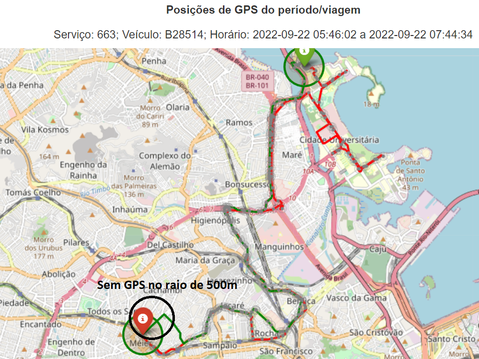

# Recurso: SMTR202212006620

---

## Contexto

**Solicitação**: "Bom dia, Solicitamos a verificação do itinerário da linha 663, por ser uma linha do tipo circular e com 2 pontos finais, verificamos que diversas viagens não estão sendo apuradas, solicitamos a verificação do itinerário".

**Linha afetada**: 663

**Período**: 01/06/2022 até 31/12/2022

## Resumo

### Problema
O solicitante compreendeu que o serviço realizou duas viagens de ida e volta, quando na verdade trata-se de apenas uma viagem circular em que o shape do trajeto é dividido em ida e volta. 

### Solução
Não se aplica. 

### Resultado

Das 24 viagens recebidas na amostra, 2 eram casos de viagens dos mesmos veículos que ocorriam em horários e dias sobrepostos, logo foram desconsideradas na análise e classificadas como "Viagem duplicada na amostra".

Quanto às 22 viagens restantes:
- 16 viagens foram identificadas com os dados de viagens apuradas e classificadas com o status "Viagem circular identificada e já paga".
- 6 viagens circulares foram consideradas inválidas por não passarem no raio de 500m do ponto inicial ou final, e foram classificadas como "Viagem circular inválida - sem sinal inicial/final dentro do raio de 500m".

Não foram encontradas inconsistências nas viagens apuradas.

> **Status: Finalizado**.

**Valor a pagar: Não se aplica**

## Análise exploratória

O Percentual de Operação Diário (POD) da linha apresentou valores abaixo do mínimo de 80% no ano de 2022:

Foi encontrada uma alteração no shape entre 31/12/2022 e 01/01/2023:

Entretanto, a partir da análise da amostra de viagens recebida, não foram encontrados indícios de a mudança do ponto médio do shape tenha causado a não identificação das viagens. 

No exemplo abaixo, é possível ver que a não conformidade da viagem ocorreu devido a não existência de sinais de GPS em um raio de 500m do ponto inicial, e que não é o ponto médio alterado pelo shape:

Viagem identificada com o shape de 2022:

Viagem não identificada com o shape de 2022 (não passou no raio de 500m):

Além disso, o solicitante compreendeu que o serviço realizou duas viagens de ida e volta, quando na verdade ocorreu apenas uma viagem.

Por exemplo, na amostra foi indicado que o veículo B28514 teria feito duas viagens na manhã do dia 27/09/2022 durante os seguintes intervalos:

- 05:50 e 05:46
- 06:51 e 07:39

A primeira viagem foi identificada como iniciada às 05:51 e terminou às 07:37, horário que abrange as duas viagens acima. Ou seja, as duas meias viagens acima são, na verdade, uma viagem circular completa.

Viagem identificada: 

Se filtrarmos o intervalo da viagem da amostra não identificada, ela retorna os sinais de GPS apenas em um sentido:

### Método de avaliação da amostra

A comparação entre o `datetime_partida` da amostra e o apurado foi feita com uma margem de 10 minutos para mais ou para menos.

