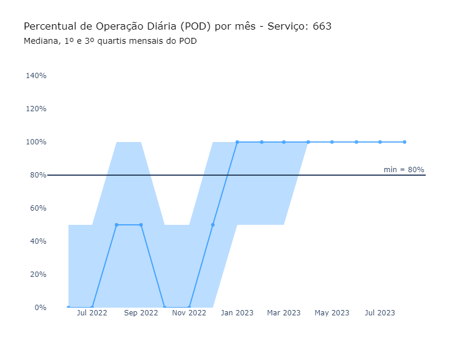
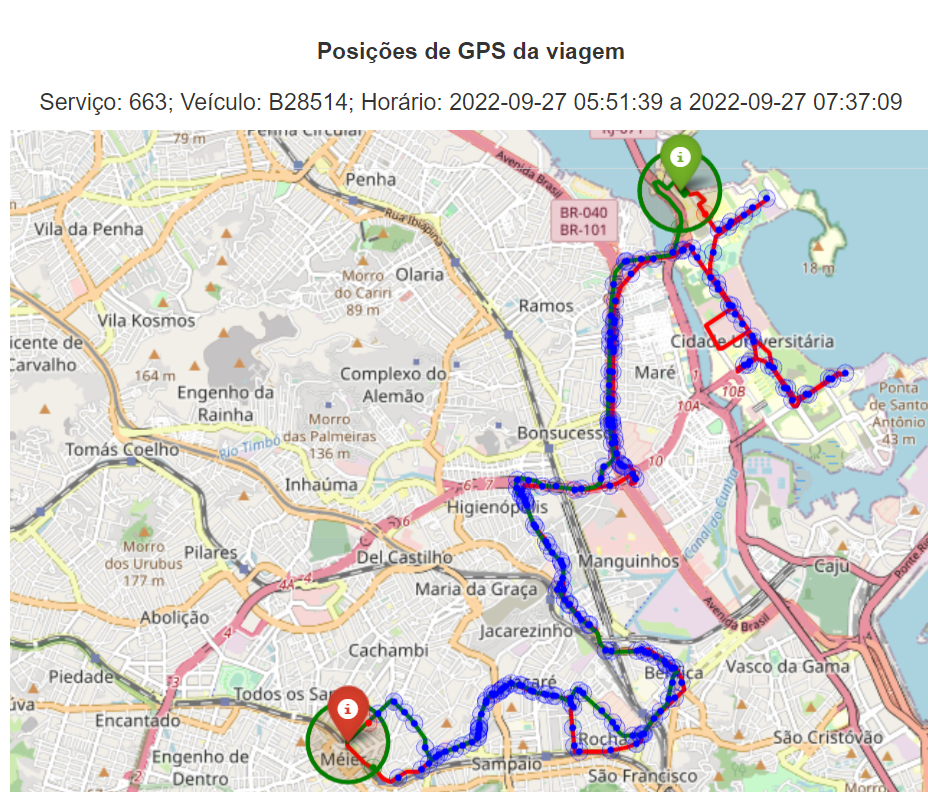
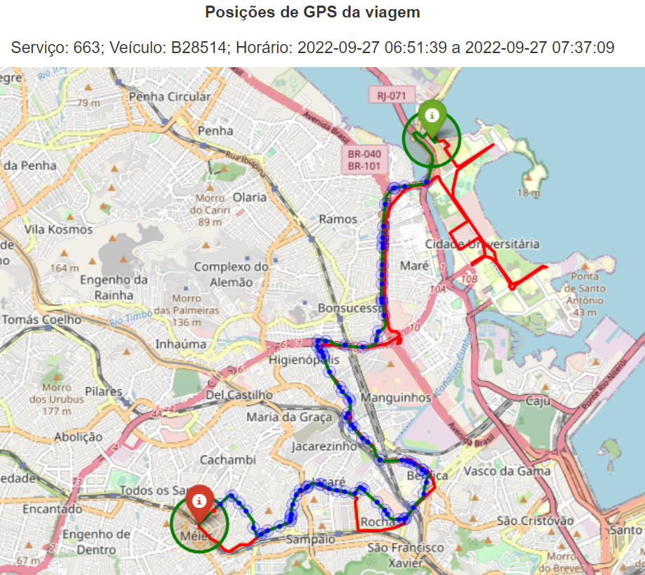

# Recurso: SMTR202212006620

---

## Contexto

**Solicitação**: "Bom dia, Solicitamos a verificação do itinerário da linha 663, por ser uma linha do tipo circular e com 2 pontos finais, verificamos que diversas viagens não estão sendo apuradas, solicitamos a verificação do itinerário".

**Linha afetada**: 663

**Período**: início em 01/06/2022

## Resumo

### Problema

Todas as viagens do ano de 2023 presentes na amostra analisada foram identificadas. 

As viagens não identificadas foram todas do ano de 2022, mas a não identificação deve-se ao fato de que o solicitante compreendeu que o serviço realizou duas viagens de ida e volta, quando na verdade ocorreu apenas uma viagem circular.

### Solução

Não se aplica.

### Resultado

> **Status: Finalizado**.

**Valor a pagar: Não se aplica**

## Análise exploratória

O que explica a variação no POD? Mudança no shape em janeiro?

Das 24 viagens recebidas na amostra, duas eram casos de viagens dos mesmos veículos que ocorriam em horários e dias sobrepostos, logo foram desconsideradas na análise.

Quanto às 22 viagens restantes:
- 13 foram identificadas com os dados de viagens apuradas.
- Em 3 viagens foi identificado o sinal de GPS, pois o serviço é circular e a viagem já havia sido identificada (caso ilustrado nos mapas abaixo).

Os mapas abaixo ilustram o caso do veículo B28514 na manhã do dia 27/09/2022.

No gabarito foi indicado que o veículo teria feito duas viagens nos seguintes intervalos:
- Entre 05:50 e 05:46
- Entre 06:51 e 07:39

A primeira viagem foi identificada como  iniciada às 05:51 e terminou às 07:37, horário que abrange as duas viagens acima.

Viagem identificada (viagem circular): 

Se filtrarmos o intervalo da viagem da amostra não identificada, ela retorna os sinais de GPS apenas em um sentido:

### Método de avaliação da amostra

A comparação entre o `datetime_partida` do gabarito e da solução foi feita com uma margem de 10 minutos para mais ou para menos.

