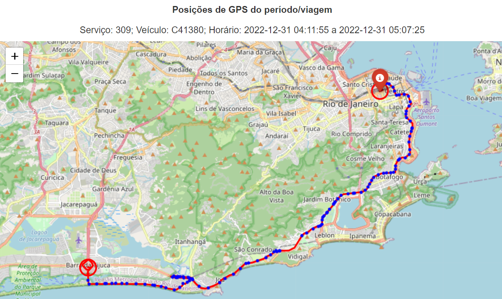

# Recurso: SMTR202302003175

---

## Contexto

**Solicitação**: "Bom dia Seguem dados que demonstram que a transmissão de GPS dos veículos da linha 309 estava ativa e disponível para a SMTR, porém as viagens de sentido VOLTA não foram apontadas no relatório de pagamento.Favor solicitar reprocessamento destes dias, senão teremos de abrir recurso para mais de 180 viagens.".

**Linha afetada**: 309

**Período**: 31/12/2022 até 01/01/2023

## Resumo

### Problema

As viagens de volta do serviço 309 nos dias 31/12/2022 e 01/01/2023 não foram identificadas.

### Solução

Em andamento.

### Resultado

> **Status: Bloqueado**. Em andamento.

**Valor a pagar: R\$ -**

## Análise exploratória

Nos dias 31/12/2022 e 01/01/2023 não foram identificadas viagens válidas com o sentido de volta na tabela `viagem_completa`. 

No dia 31/12/2022, as viagens de volta foram registradas na tabela `viagem_conformidade`, sem nenhum problema de conformidade.

No dia 01/01/2023, nenhuma viagem foi registrada na tabela `viagem_conformidade`, apesar de existirem viagens de ida na tabela `viagem_completa`.

Especificamente nesses dias existem 2 shapes de ida devido ao fechamento de vias no reveillon. O algoritmo foi ajustado para receber mais um shape e escolher o shape de ida com o maior fit, o que parece ter funcionado adequadamente. 

##### Exemplo de viagem de ida com 2 shapes:

##### Exemplo de viagem de volta com 1 shape:

### Método de avaliação da amostra

A comparação entre o `datetime_partida` do gabarito e da solução foi feita com uma margem de 10 minutos para mais ou para menos.

### Resultados

Em andamento.