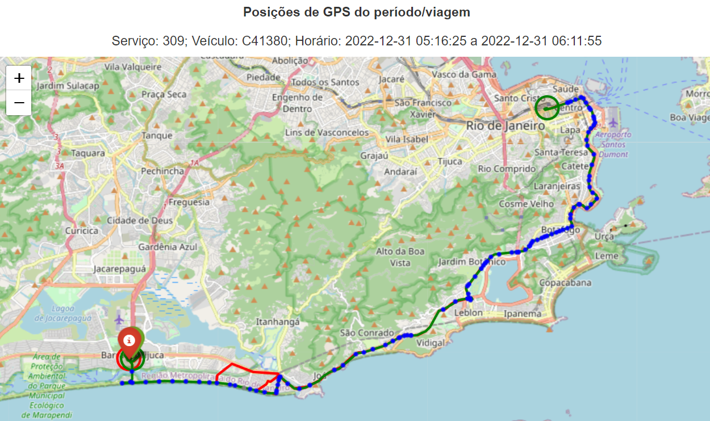
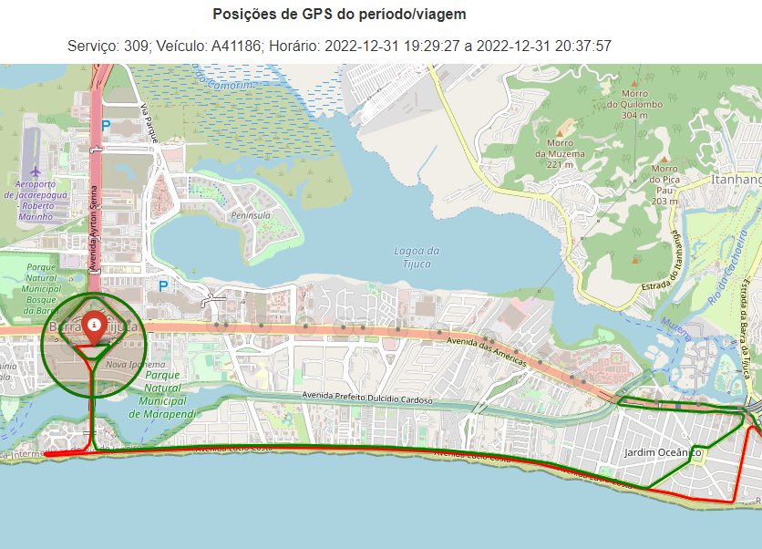
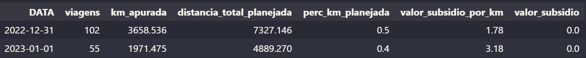
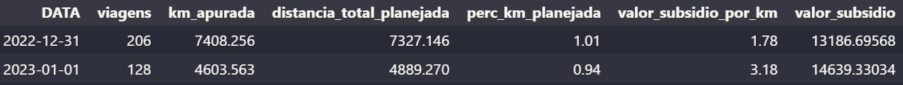

# Recurso: SMTR202302003175

---

## Contexto

**Solicitação**: "Bom dia Seguem dados que demonstram que a transmissão de GPS dos veículos da linha 309 estava ativa e disponível para a SMTR, porém as viagens de sentido VOLTA não foram apontadas no relatório de pagamento.Favor solicitar reprocessamento destes dias, senão teremos de abrir recurso para mais de 180 viagens.".

**Linha afetada**: 309

**Período**: 31/12/2022 até 01/01/2023

## Resumo

### Problema

As viagens de volta do serviço 309 nos dias 31/12/2022 e 01/01/2023 não foram identificadas.

Consequentemente o POD destes dias foi menor do que 80% e a operadora não recebeu o subsídio.

### Solução

Foi identificado que a tabela `viagem_completa` não estava identificando o planejamento do serviço 309 nos dias 31/12/2022 e 01/01/2023 devido aos horários de inicio e fim do shape definidos pelo planejamento operacional destes dias. Foi feita uma alteração no modelo para incorporar os novos horários. 

### Resultado

> **Status: Finalizado.** 

**Valor a pagar: R\$ 27.826,02**

Subsidio por km de R\$ 1,78 no dia 31/12/2022 e de R\$ 3,18 no dia 01/01/2023.

## Análise exploratória

Nos dias 31/12/2022 e 01/01/2023 não foram identificadas viagens válidas com o sentido de volta na tabela `viagem_completa`. 

No dia 31/12/2022, as viagens de volta foram registradas na tabela `viagem_conformidade`, sem nenhum problema de conformidade.

No dia 01/01/2023, nenhuma viagem foi registrada na tabela `viagem_conformidade`.

Especificamente nesses dias existem 2 shapes de ida devido ao fechamento de vias no reveillon. O algoritmo foi ajustado para receber mais um shape e escolher o shape de ida com o maior fit, o que funcionou adequadamente. 

##### Exemplo de viagem de ida com 2 shapes:

O problema foi no sentido de volta, já que a tabela `viagem_completa` não estava considerando a viagem planejada neste sentido nos dias supracitados.

##### Exemplo de viagem de volta com 1 shape:

### Método de avaliação da amostra

A comparação entre o `datetime_partida` da amostra e da solução foi feita com uma margem de 10 minutos para mais ou para menos.

### Resultados

Das 181 viagens no sentido de volta em 31/12/2022 e 01/01/2023:

**Análise pré-solução:**

- 102 não atenderam aos critérios de conformidade; e
- 79 não foram identificadas.

**Análise pós-solução:**

- 174 viagens deferidas;
- 4 viagens em que o sinal de GPS do veículo operou em serviço diferente da amostra;    
- 1 viagem em que não houve sinal de GPS para o veículo no momento da viagem; 
- 1 viagem em que o veículo não passou no raio de 500m do ponto inicial/final; e
- 1 viagem em que o veículo desviou do trajeto previsto.

Viagem com desvio do trajeto previsto:
                                             

### Método de avaliação da amostra

A comparação entre o `datetime_partida` do gabarito e da solução foi feita com uma margem de 10 minutos para mais ou para menos.

## Reprocessamento

O reprocessamento seguindo os critérios acima para o período entre 31/12/2022 e 01/01/2023 está disponível no dataset `rj-smtr-dev.SMTR202302003175_reprocessamento`. 

### Resultados

Dados pré-reprocessamento:

Dados pós-reprocessamento:

