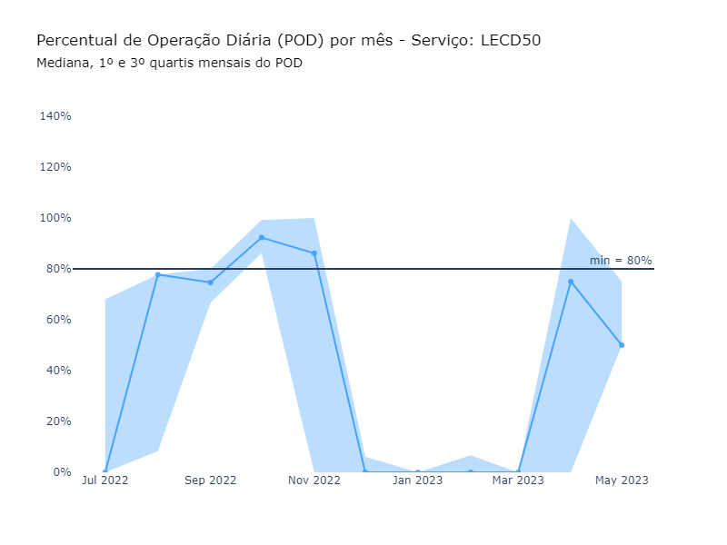
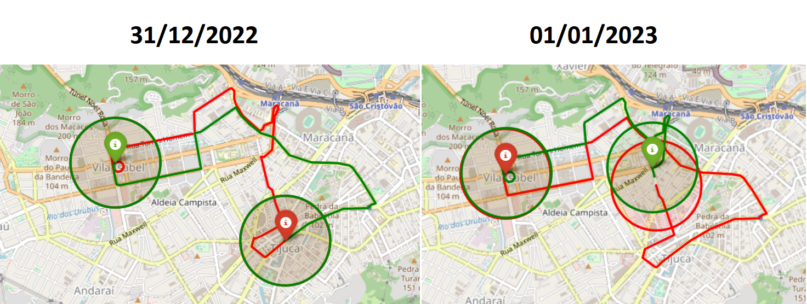
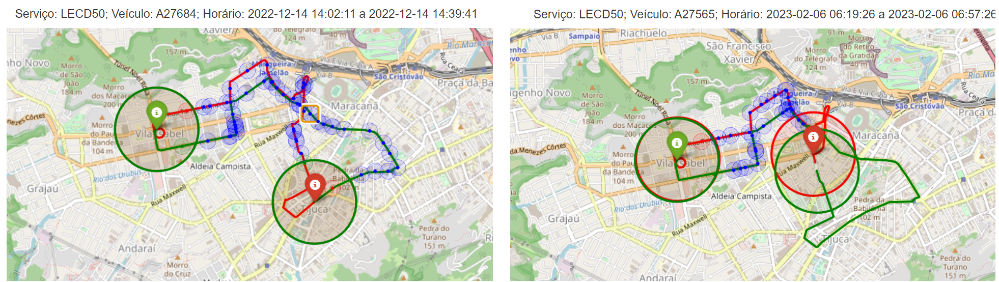
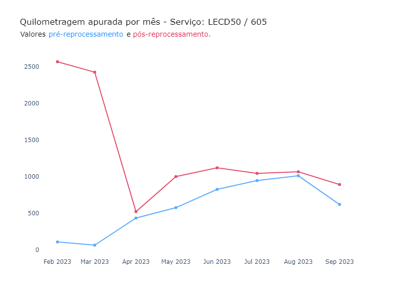
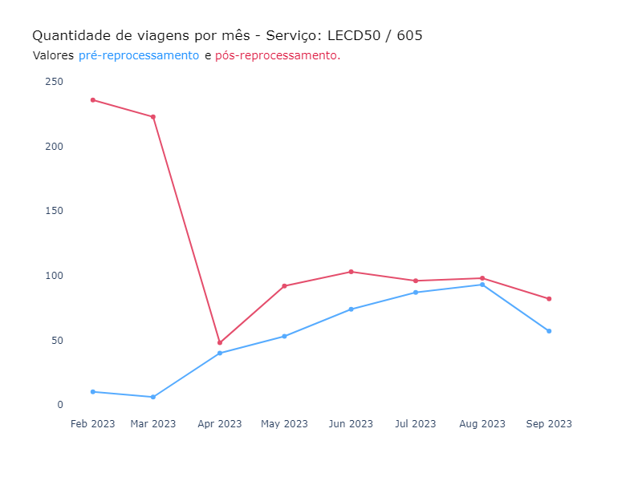
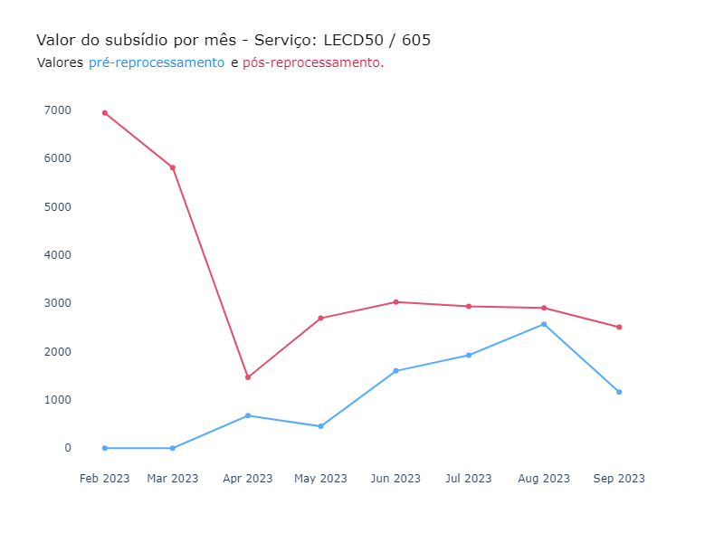
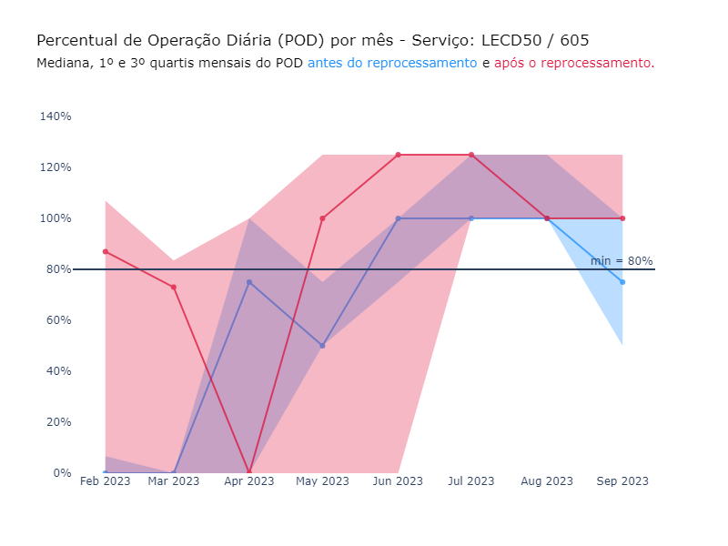

# Recurso: SMTR202303002183

**Solicitação**:
"Caros Favor verificar o itinerário da linha LECD50 linha circular que não está abrindo viagem, parece que sistema inseriu um ponto final que não representa a localização real, problema similar a 010, 844. Segue mapa da linha".

**Linha afetada**: LECD50 / 605

**Período**: 01/01/2023 até indefinido (aguardando correção do shape pela equipe de planejamento).

--------

### <ins>**Sumário Executivo**</ins>

 

**1 - Problema encontrado**: 

Foi identificada uma queda no POD entre os dias 15 de dezembro de 2022 e 31 de março de 2023. 

Após a verificação das viagens no período, foi constatado que:

- A mudança do shape no dia 01/01/2023 fez com que as viagens não fossem identificadas corretamente. 

- O problema foi percebido a partir de fevereiro de 2023, já que não houveram viagens para o serviço em janeiro de 2023. Inclusive as viagens que constam na tabela de viagens completas não foram devidamente identificadas, contendo apenas metade do trajeto esperado (ver figuras na próxima parte). 

- O problema afetou as viagens da LECD50 (Entre 01/01/2023 e 31/05/2023) e da 605 (De 01/06/2023 até hoje).

**2 - Solução proposta**: 

Reprocessar as viagens da LECD50 e da 605 no período entre 01/01/2023 e 30/09/2023 (incluir outubro depois) com shape de dezembro da linha LECD50 .

Obs: A expectativa é que o problema seja solucionado com a correção do shape por parte da equipe de planejamento: expectativa: 2ª quinzena/out.
Assim que isto for feito, os dias referentes ao mês de outubro deverão ser reprocessados. Até hoje (26/10/2023), o shape não foi corrigido.

**3 - Resultado**:

> **Status: Em andamento** - falta incluir valores separados das glosas e incluir reprocessamento de outubro/23

Valor pago pré-reprocessamento: R\$ 8.388,97
Valor a pagar pós-reprocessamento: R\$ 28.309,07

**Valor a pagar: R\$ 19.920,10 (falta calcular o valor do mês de outubro)**
Obs: considerando o valor subsidiado de R\$ 2,81 por km.

As viagens que ocorreram nas datas que constam na amostra foram classificadas e estão disponíveis no diretório `data/output/analise_amostra_pre_solucao.xlsx`.

As linhas LECD50 e 605 foram afetadas pelo problema, que teve início em 01/01/2023, quando o ponto médio do shape das viagens foi alterado, o que resultou na incorreta identificação de parte das viagens (ver figuras na próxima parte).

Observações:

- A linha LECD50 teve serviço planejado e sinais de GPS registrados até 31/05/2023. A partir de 01/06/2023, o serviço mudou de nome para 605.

- Em dezembro/22 ocorreram viagens até o dia 14 e a identificação das viagens ocorreu da forma correta.

- Em janeiro/23 não existiu sinal de GPS para os serviços analisados no recurso.

 

### 1) Análise exploratória

Foi encontrada uma queda no POD entre dezembro de 2022 e março de 2023:

No final do ano, houve uma mudança no ponto médio do shape:

Que resultou na identificação incorreta das viagens desde então:

Mesmo aquelas viagens que constam na tabelas `viagem_completa` e já foram pagas, não foram identificadas corretamente.

### 2) Teste amostral

**Análise pré-solução:**

A amostra recebida contem 981 viagens, das quais:

- 495 viagens que não atenderam ao critério de conformidade;
- 422 viagens identificadas e já pagas;
- 62 casos em que o veículo não passou no raio de 500m do ponto de partida/final do trajeto; e
- 2 casos em que o serviço não foi planejado para o dia.

A elevada quantidade de viagens que não atenderam a conformidade reforça a hipótese de que é a alteração no ponto médio do shape que está atrapalhando a devida identificação das viagens.

**Análise pós-solução:**

- 978 viagens deferidas (422 viagens já pagas + 556 viagens pagas após o reprocessamento);
- 2 casos em que o serviço não foi planejado para o dia; e
- 1 viagens que não atendeu ao critério de conformidade.

As duas viagens em que o serviço não estava planejado no dia foram viagens da linha 605 no dia 31/05/2023, um dia antes de o serviço passar a se chamar 605. 

Viagens identificadas por mês após a alteraçao do shape:

| Mês/Ano | Viagens    |
|:-------:|:----------:|
| Fev/23  | 236        |
| Mar/23  | 223        |
| Abr/23  | 48         |
| Mai/23  | 92         |
| Jun/23  | 103        |
| Jul/23  | 96         |
| Ago/23  | 98         |
| Set/23  | 82         |
| Out/23  | Aguardando o fechamento do mês  |

### Método de avaliação da amostra

A comparação entre o `datetime_partida` do gabarito e da solução foi feita com uma margem de 10 minutos para mais ou para menos.

## Reprocessamento

O reprocessamento seguindo os critérios acima para o período entre 01/02/2023 e 30/09/2023 está disponível no dataset `rj-smtr-dev.SMTR202303002183_reprocessamento`. 

### Resultados

1) A quilometragem total das viagens completas aumentou de XXXX km para XXXX km, um aumento de XXX% após o reprocessamento.

2) A quantidade de viagens identificadas aumentou de XX para XX viagens. 

3) O valor do subsídio antes do reprocessamento era de R\$ XXX e após o reprocessamento foi de R\$ XXX. Vale destacar que o valor do reprocessamento foi calculado sem os descontos por km, ou seja, considerando a liminar que derrubou as glosas.

4) Por fim, o fato de o reprocessamento ter identificado mais viagens também melhorou o POD do serviço forma geral. O mês de abril registrou apenas 12 dias em que a LECD50 operou, o que explica a mediana igual a zero.

