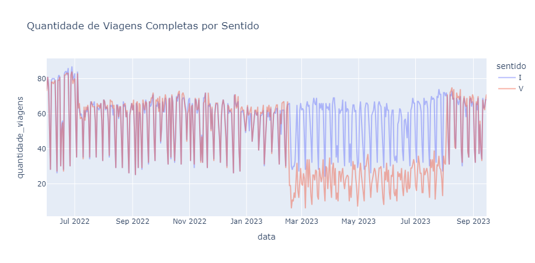
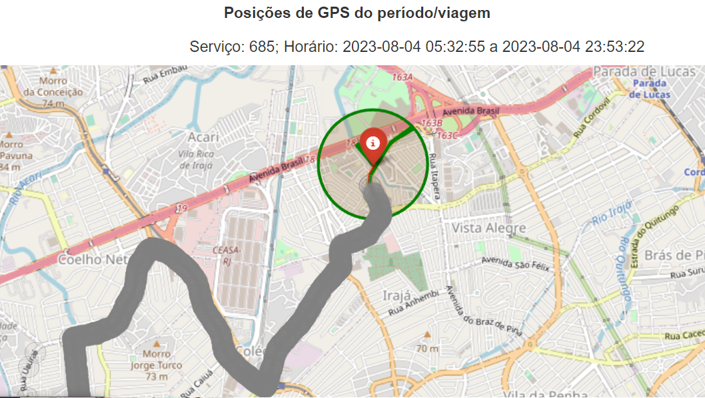

# Recurso: SMTR202306003479
---

## Contexto

**Solicitação**: "Caros Bom dia. Está ocorrendo uma falha na Linha 685, onde estamos perdendo diversas viagens de volta. Já realizamos uma verificação nos dados de GPS, enviados à SMTR de 1 dia e não identificamos motivos para o não pagamento de diversas viagens. Solicitamos uma analise nos dados da linha, para identificação do problema e o reprocessamento das viagens".

**Linha afetada**: 685

**Período**: 01/02/2023 até 15/06/2023

## Resumo

### Problema

Foi identificada uma queda na quantidade de viagens de volta no período entre 15/02/2023 e 03/08/2023, mesmo com a existência de sinais de GPS para o serviço 685.

### Solução

A operadora passou a realizar o trajeto no sentido de volta da forma correta a partir de 04/08/2023, o que resultou na identificação correta das viagens.

### Resultado

> **Status: Finalizado**. 

**Valor a pagar: -**

A queda na quantidade de viagens de volta foi resultante do desvio realizado pelos veículos no trecho próximo ao ponto final.

## Análise exploratória

Foi identificada uma queda na quantidade de viagens de volta entre 15/02/2023 e 03/08/2023.

Ao realizar a comparação entre as viagens de volta dos dia 14 e 15 de fevereiro de 2023, nota-se a diferença no trajeto realizado pelos veículos:

Este desvio fez com que parte significativa das viagens de volta não fossem identificadas. 

Os casos das viagens de volta que fizeram o desvio no trajeto, e mesmo assim foram identificadas, pode ser explicado pelo fato de que o último sinal de GPS emitido antes do veículo entrar no raio de entorno do ponto final foi um ponto dentro dos 500m do trajeto, e não um ponto fora do limite dos 500m, como foi o caso das viagens não identificadas.

A partir do dia 04/08/2023, as viagens de volta foram realizadas de forma correta e foram devidamente identificadas. O mapa abaixo mostra os sinais de GPS de todas as viagens de volta na data supracidata:

Obs: Ao longo do período afetado, não houve alteração no trajeto/shape do serviço.

### Método de avaliação da amostra

A comparação entre o `datetime_partida` da amostra e da solução foi feita com uma margem de 10 minutos para mais ou para menos.

### Resultados

A amostra recebida contém 132 viagens realizadas por 25 veículos diferentes no dia 31/05/2023, das quais:

- 89 já foram identificadas e pagas anteriormente;
- 27 não foram identificadas devido ao desvio no trajeto;
- 11 não foram identificadas pois operaram em serviço diferente (SVB685); e 
- 5 não passaram dentro do raio de 500m do ponto final.

